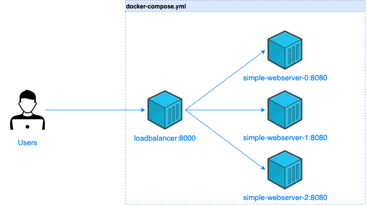

# loadbalancer-go
This project demonstrates how a load balancer work under the hood basically using Goland and Docker. So that you can know how to troubleshoot it when there are issue with load balancing service on the cloud platform like AWS, Azure or GCP.
P/s: Credit goes to @swayne275 because I use his [load balancer code](https://github.com/swayne275/load-balancer-proxy).

## Overview

Structure of this project:
- [simple-webserver](./simple-webserver/): store simple-webserver code and Dockerfile to build image.
- [loadbalancer](./loadbalancer/): loadbalancer code from @swayne275.

